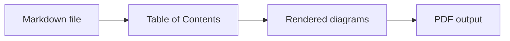

# chrtmnn's md scripts

## Table of Contents

<!-- START doctoc generated TOC please keep comment here to allow auto update -->
<!-- DON'T EDIT THIS SECTION, INSTEAD RE-RUN doctoc TO UPDATE -->

- [Prerequisites](#prerequisites)
- [Global Wrapper](#global-wrapper)
- [Markdown to PDF - `md2pdf`](#markdown-to-pdf---md2pdf)
- [Mermaid Syntax Example](#mermaid-syntax-example)

<!-- END doctoc generated TOC please keep comment here to allow auto update -->

## Prerequisites

- Node.js (incl. npm/npx) available in `PATH`.
- pnpm available in `PATH`.
- Internet access for the first run so `npx` can fetch `doctoc`, `@mermaid-js/mermaid-cli` and `md-to-pdf` (or install
  them globally ahead of time with `npm install -g doctoc @mermaid-js/mermaid-cli md-to-pdf`).

## Global Wrapper

Run the install script once from the repository root to add the `bin` directory to your user `PATH`:

```powershell
.\install.ps1
```

Restart your terminal afterwards. To remove the entry from `PATH` later:

```powershell
.\uninstall.ps1
```

The wrapper changes into this repository, runs `pnpm md2pdf`, and resolves relative input/output paths against the
directory where you called it.

**Examples**

Run from another directory with relative paths:

  ```powershell
  md2pdf README.md
  ```

Write the PDF to a relative output directory:

  ```powershell
  md2pdf -o pdf README.md
  ```

## Markdown to PDF - `md2pdf`

**Usage**

`pnpm md2pdf [-s pdf.css] [--css-var name=value] [-o output_dir] [-r temp_root | -p] [-f] [-u] [-k] [files...]`

**Options**

| option                    | description                                                                                               |
|---------------------------|-----------------------------------------------------------------------------------------------------------|
| `-s, --stylesheet <file>` | Stylesheet passed to md-to-pdf (--stylesheet). Defaults to `src/css/default.css`.                         |
| `--css-var <name=value>`  | Override a CSS custom property for this run. The leading `--` is optional. Repeat for multiple variables. |
| `-o, --output-dir <dir>`  | Output directory for PDFs (default: alongside each input file).                                           |
| `-r, --temp-root <dir>`   | Root directory for temp work dirs (default: system temp).                                                 |
| `-p, --temp-in-output`    | Place temp dir inside the output directory (or source dir if -o is absent).                               |
| `-f, --force-doctoc`      | Force `doctoc` even when the file has no existing TOC markers (temp copy only).                           |
| `-u, --update-md-toc`     | Update an existing doctoc TOC in the original Markdown file. Does not create a new TOC.                   |
| `-k, --keep-temp`         | Keep temp working directory (prints its path).                                                            |
| `-h, --help`              | Show help.                                                                                                |

**Notes**

- CLI parsing uses [`commander`](https://www.npmjs.com/package/commander).
- Running without files prints help and exits without starting the conversion pipeline.
- The pipeline uses [`doctoc`](https://www.npmjs.com/package/doctoc), [
  `@mermaid-js/mermaid-cli`](https://www.npmjs.com/package/@mermaid-js/mermaid-cli) and [
  `md-to-pdf`](https://www.npmjs.com/package/md-to-pdf).
- Package scripts run TypeScript directly via `tsx`.
- Existing TOC markers (`<!-- START doctoc ... -->`) are always refreshed automatically on the temp copy. `-f` forces
  TOC creation on the temp copy even when none exists yet. `-u` also updates an existing TOC in the original Markdown
  file, but never creates a new source TOC.

**Examples**

Run the full Markdown-to-PDF pipeline:

  ```bash
  pnpm md2pdf -f README.md
  ```

Run the full pipeline with CSS variable overrides:

  ```bash
  pnpm md2pdf --css-var heading-page-break-before=auto --css-var heading-break-before=auto README.md
  ```

Update an existing source TOC while running the full pipeline:

  ```bash
  pnpm md2pdf -u README.md
  ```

## Mermaid Syntax Example

**Markdown input**

<pre><code>```mermaid
flowchart LR
  Markdown[Markdown file] --> Toc[Table of Contents]
  Toc --> Diagrams[Rendered diagrams]
  Diagrams --> Pdf[PDF output]
```</code></pre>

**Rendered preview**



> More: https://mermaid.js.org/intro/syntax-reference.html
