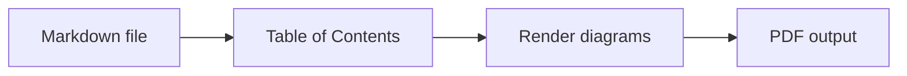

# chrtmnn's md scripts

Convert Markdown files to PDF from any terminal with one command:

```powershell
md2pdf README.md
```

The command shows a compact progress view, refreshes an existing doctoc table of contents on a temporary copy, renders Mermaid diagrams, and writes a PDF next to the Markdown file unless another output directory is configured.

## Installation

Prerequisites:

- Node.js with `npm`/`npx` available in `PATH`
- Internet access on first use so `npx` can fetch the conversion tools

Run the install script once from this repository:

```powershell
.\install.ps1
```

The script installs pnpm globally (with confirmation) if it is not already available, runs `pnpm install` if dependencies are missing, and adds the `bin/` directory to your user `PATH`. Restart your terminal afterwards. The `md2pdf` command is then available from any directory.

## Usage

Convert one Markdown file:

```powershell
md2pdf README.md
```

Convert multiple files:

```powershell
md2pdf README.md docs\usage.md
```

Write PDFs to an output directory:

```powershell
md2pdf -o pdf README.md
```

Update an existing TOC in the original Markdown file while converting:

```powershell
md2pdf -u README.md
```

Create a TOC on the temporary conversion copy even when the source file has no doctoc markers:

```powershell
md2pdf -f README.md
```

Show help:

```powershell
md2pdf
```

Show output from the underlying conversion tools:

```powershell
md2pdf --verbose README.md
```

## Options

`md2pdf [-s pdf.css] [--css-var name=value] [-o output_dir] [-r temp_root | -p] [-f] [-u] [-k] [--verbose] [files...]`

| option                    | description                                                                                               |
|---------------------------|-----------------------------------------------------------------------------------------------------------|
| `-s, --stylesheet <file>` | Stylesheet for the generated PDF. Defaults to `src/css/default.css`.                                      |
| `--css-var <name=value>`  | Override a CSS custom property for this run. The leading `--` is optional. Repeat for multiple variables. |
| `-o, --output-dir <dir>`  | Output directory for PDFs. Defaults to each Markdown file's directory.                                    |
| `-r, --temp-root <dir>`   | Root directory for temporary work dirs. Defaults to the system temp directory.                            |
| `-p, --temp-in-output`    | Place the temporary work dir inside the output directory.                                                 |
| `-f, --force-doctoc`      | Create or refresh a TOC on the temporary conversion copy, even without source TOC markers.                 |
| `-u, --update-md-toc`     | Update an existing doctoc TOC in the original Markdown file. Does not create a new source TOC.             |
| `-k, --keep-temp`         | Keep the temporary work directory and print its path.                                                     |
| `--verbose`               | Print output from doctoc, mermaid-cli, and md-to-pdf while they run.                                      |
| `-h, --help`              | Show help.                                                                                                |

## Uninstall

Remove the wrapper from your user `PATH`:

```powershell
.\uninstall.ps1
```

Restart your terminal afterwards.

## Mermaid Diagram Syntax

Mermaid code fences are rendered automatically during conversion. For further information visit https://mermaid.js.org/intro/syntax-reference.html.

**Markdown input**:

<pre><code>```mermaid
flowchart LR
  A[Markdown file] --> B[Table of Contents]
  B --> C[Render diagrams]
  C --> D[PDF output]
```</code></pre>

**Rendered preview**:


