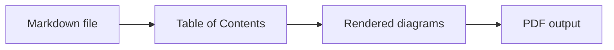

# chrtmnn's md scripts

## Table of Contents

<!-- START doctoc generated TOC please keep comment here to allow auto update -->
<!-- DON'T EDIT THIS SECTION, INSTEAD RE-RUN doctoc TO UPDATE -->
  

- [Prerequisites](#prerequisites)
- [Global Wrapper](#global-wrapper)
- [Markdown to PDF - `md2pdf`](#markdown-to-pdf---md2pdf)
- [Table of Contents - `toc`](#table-of-contents---toc)
- [Mermaid Diagrams - `diagrams`](#mermaid-diagrams---diagrams)
  - [Mermaid Syntax Example](#mermaid-syntax-example)
- [PDF Only - `pdf`](#pdf-only---pdf)

<!-- END doctoc generated TOC please keep comment here to allow auto update -->

## Prerequisites

- Node.js (incl. npm/npx) available in `PATH`.
- pnpm available in `PATH`.
- Internet access for the first run so `npx` can fetch `doctoc`, `@mermaid-js/mermaid-cli` and `md-to-pdf` (or install
  them globally ahead of time with `npm install -g doctoc @mermaid-js/mermaid-cli md-to-pdf`).

## Global Wrapper

Run the install script once from the repository root to add the `bin` directory to your user `PATH`:

```powershell
.\install.ps1
```

Restart your terminal afterwards. To remove the entry from `PATH` later:

```powershell
.\uninstall.ps1
```

The wrapper changes into this repository, runs `pnpm md2pdf`, and resolves relative input/output paths against the
directory where you called it.

**Examples**

Run from another directory with relative paths:

  ```powershell
  md2pdf README.md
  ```

Write the PDF to a relative output directory:

  ```powershell
  md2pdf -o pdf README.md
  ```

## Markdown to PDF - `md2pdf`

**Usage**

`pnpm md2pdf [-s pdf.css] [--css-var name=value] [-o output_dir] [-r temp_root | -p] [-t] [-k] file1.md [file2.md ...]`

**Options**

| option | description |
|--------|-------------|
| `-s, --stylesheet <file>` | Stylesheet passed to md-to-pdf (--stylesheet). Defaults to `src/css/default.css`. |
| `--css-var <name=value>` | Override a CSS custom property for this run. The leading `--` is optional. Repeat for multiple variables. |
| `-o, --output-dir <dir>` | Output directory for PDFs (default: alongside each input file). |
| `-r, --temp-root <dir>` | Root directory for temp work dirs (default: system temp). |
| `-p, --temp-in-output` | Place temp dir inside the output directory (or source dir if -o is absent). |
| `-t, --force-doctoc` | Force `doctoc` even when the file has no existing TOC markers (temp copy only). |
| `-k, --keep-temp` | Keep temp working directory (prints its path). |
| `-h, --help` | Show help. |

**Notes**

- CLI parsing uses [`commander`](https://www.npmjs.com/package/commander).
- The pipeline uses [`doctoc`](https://www.npmjs.com/package/doctoc), [`@mermaid-js/mermaid-cli`](https://www.npmjs.com/package/@mermaid-js/mermaid-cli) and [`md-to-pdf`](https://www.npmjs.com/package/md-to-pdf).
- Package scripts run TypeScript directly via `tsx`.
- Existing TOC markers (`<!-- START doctoc ... -->`) are always refreshed automatically. `-t` forces TOC creation even when none exists yet. Both run on a temp copy, leaving the source unchanged.

**Examples**

Run the full Markdown-to-PDF pipeline:

  ```bash
  pnpm md2pdf -t README.md
  ```

Run the full pipeline with CSS variable overrides:

  ```bash
  pnpm md2pdf --css-var heading-page-break-before=auto --css-var heading-break-before=auto README.md
  ```

## Table of Contents - `toc`

**Usage**

`pnpm toc file1.md [file2.md ...]`

**Notes**

- Updates the source Markdown files in place.
- Uses [`doctoc`](https://www.npmjs.com/package/doctoc); override the package selector with `DOCTOC_PKG`.

**Examples**

Update the table of contents in Markdown files:

  ```bash
  pnpm toc README.md
  ```

Update multiple Markdown files:

  ```bash
  pnpm toc README.md docs/usage.md
  ```

## Mermaid Diagrams - `diagrams`

**Usage**

`pnpm diagrams [-o output_dir] file1.md [file2.md ...]`

**Options**

| option | description |
|--------|-------------|
| `-o, --output-dir <dir>` | Output directory for converted Markdown files. |
| `-h, --help` | Show help. |

**Notes**

- Renders Mermaid fences to SVG and writes converted Markdown files.
- Uses [`@mermaid-js/mermaid-cli`](https://www.npmjs.com/package/@mermaid-js/mermaid-cli); override the package selector with `MERMAID_CLI_PKG`.

**Examples**

Render Mermaid diagrams into a converted Markdown file:

  ```bash
  pnpm diagrams -o . README.md
  ```

Render Mermaid diagrams for multiple files into `tmp`:

  ```bash
  pnpm diagrams -o tmp README.md docs/usage.md
  ```

### Mermaid Syntax Example

**Markdown input**

<pre><code>```mermaid
flowchart LR
  Markdown[Markdown file] --> Toc[Table of Contents]
  Toc --> Diagrams[Rendered diagrams]
  Diagrams --> Pdf[PDF output]
```</code></pre>

**Rendered preview**



> More: https://mermaid.js.org/intro/syntax-reference.html

## PDF Only - `pdf`

**Usage**

`pnpm pdf [-s pdf.css] [--css-var name=value] [-o output_dir] file1.md [file2.md ...]`

**Options**

| option | description |
|--------|-------------|
| `-s, --stylesheet <file>` | Stylesheet passed to md-to-pdf. Defaults to `src/css/default.css`. |
| `--css-var <name=value>` | Override a CSS custom property for this run. Repeat for multiple variables. |
| `-o, --output-dir <dir>` | Output directory for PDFs. |
| `-h, --help` | Show help. |

**Notes**

- Converts Markdown to PDF without running `doctoc` or `mermaid-cli`.
- Uses [`md-to-pdf`](https://www.npmjs.com/package/md-to-pdf).
- Use this after `pnpm diagrams` if the file already references rendered diagram assets.

**Examples**

Convert an already prepared Markdown file to PDF:

  ```bash
  pnpm pdf README_converted.md
  ```

Convert a prepared Markdown file with CSS overrides:

  ```bash
  pnpm pdf --css-var heading-break-before=auto README_converted.md
  ```
